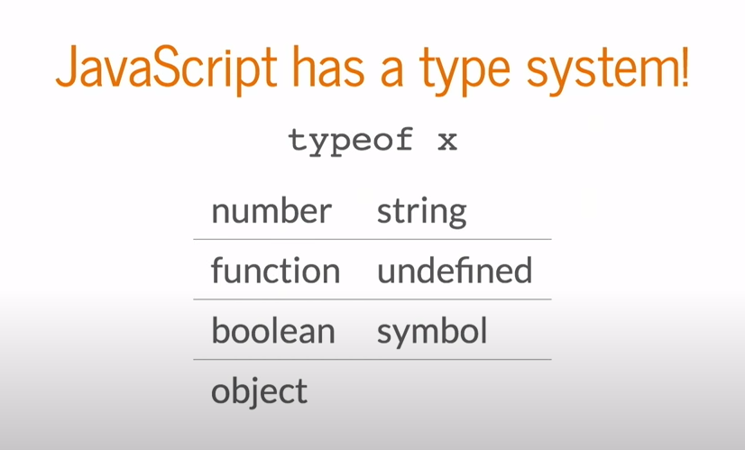
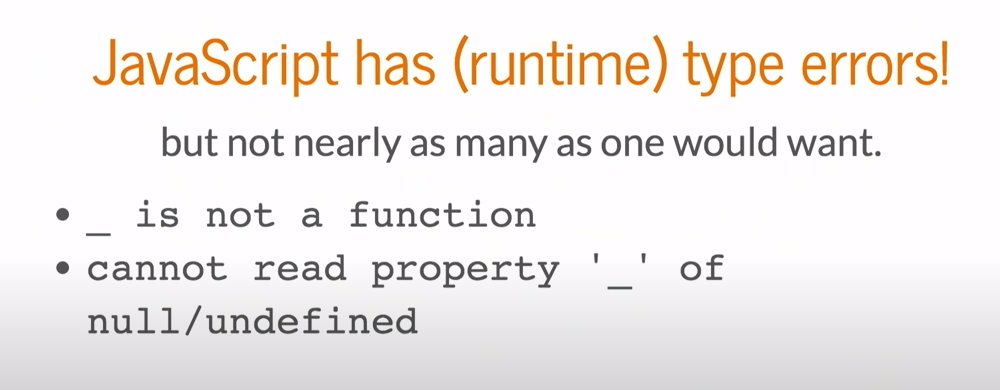
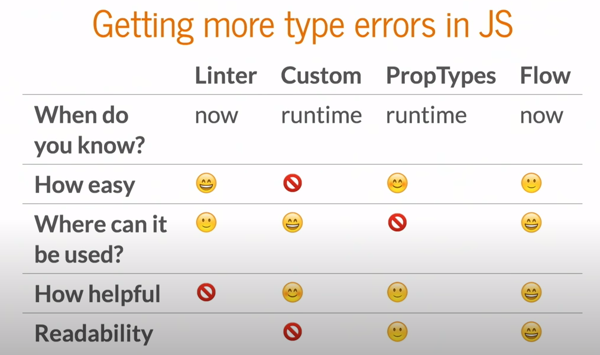
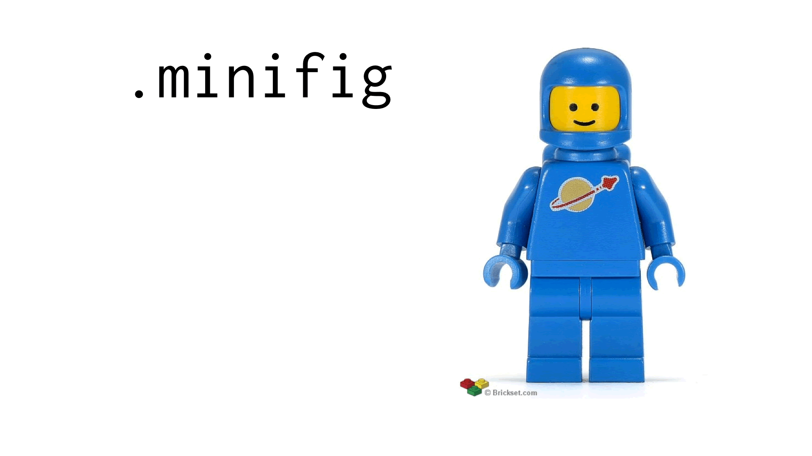
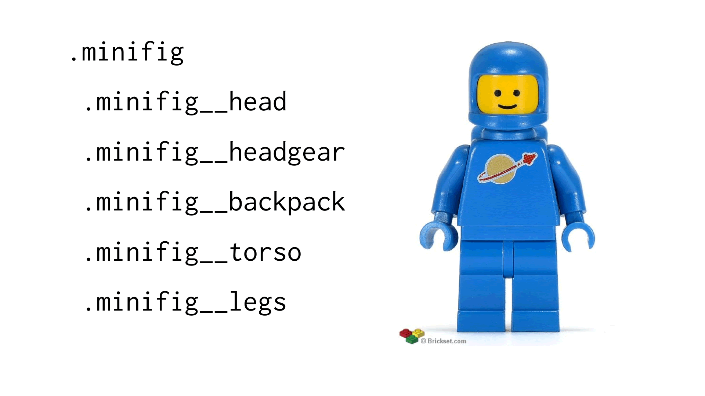
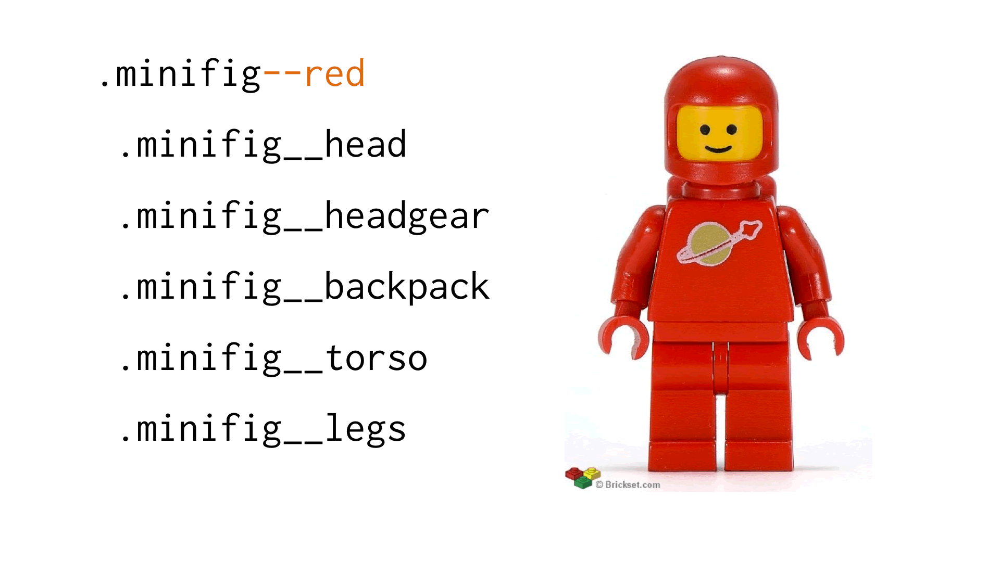
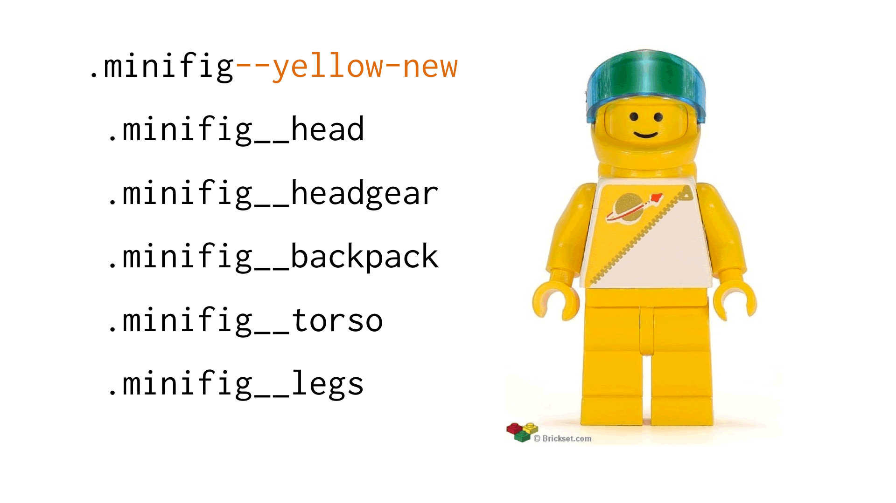
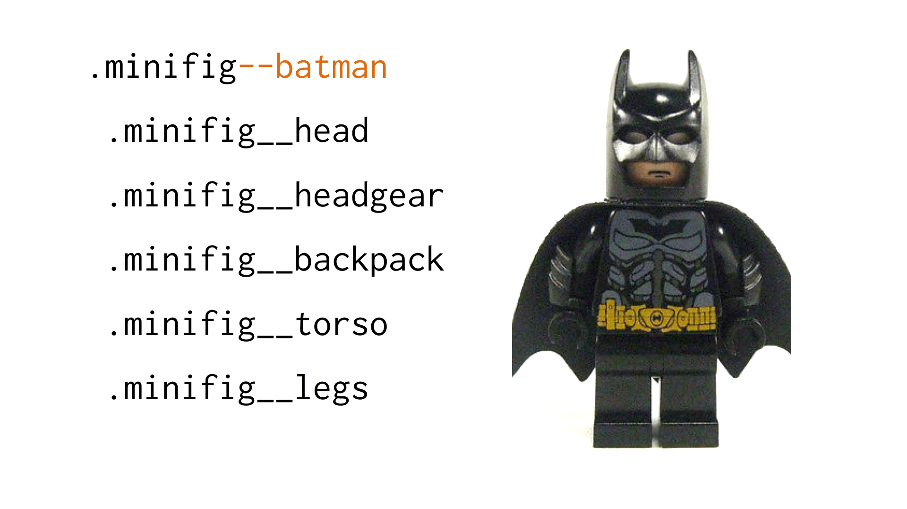
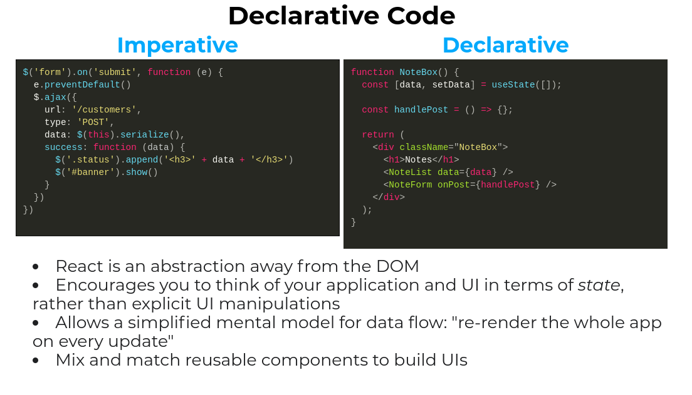
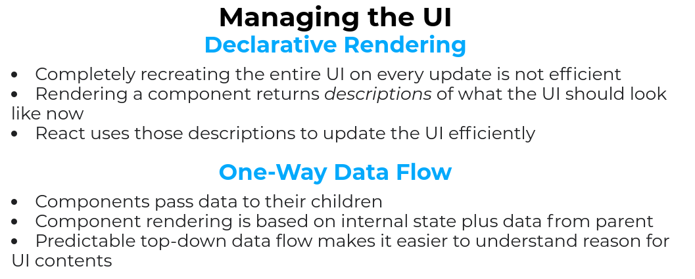

- add jsconfig: not to add relative paths
- jest.config.js = create react apps and react scripts actually comes with jest configuration built-in. We just added for purposes of this tutorial.

## FLOW

Flow is a static type checker for your JavaScript code. It does a lot of work to make you more productive. Making you code faster, smarter, more confidently, and to a bigger scale.

Flow checks your code for errors through static type annotations. These types allow you to tell Flow how you want your code to work, and Flow will make sure it does work that way.

```javascript
// @flow
function square(n: number): number {
  return n * n;
}

square("2"); // Error!
```

Because Flow understands JavaScript so well, it doesn’t need many of these types. You should only ever have to do a minimal amount of work to describe your code to Flow and it will infer the rest. A lot of the time, Flow can understand your code without any types at all.

```javascript
// @flow
function square(n) {
  return n * n; // Error!
}

square("2");
```

You can also adopt Flow incrementally and easily remove it at anytime, so you can try Flow out on any codebase and see how you like it.

```javascript
yarn run flow init
yarn run flow
flow status

```

## Types & Expressions

In JavaScript there are many types of values: numbers, strings, booleans, functions, objects, and more.

```javascript
(1234: number);
("hi": string);
(true: boolean);
([1, 2]: Array<number>);
({ prop: "value" }: Object);
(function method() {}: Function);
```

These values can be used in many different ways:

```javascript
1 + 2;
"foo" + "bar";
!true;
[1, 2].push(3);
let value = obj.prop;
obj.prop = "value";
method("value");
```

All of these different expressions create a new type which is a result of the types of values and the operations run on them.

```javascript
let num: number = 1 + 2;
let str: string = "foo" + "bar";
```

> In Flow every value and expression has a type.

### Figuring out types statically

`Flow needs a way to be able to figure out the type of every expression. But it can’t just run your code to figure it out, if it did it would be affected by any issues that your code has. For example, if you created an infinite loop Flow would wait for it to finish forever. -- Instead, Flow needs to be able to figure out the type of a value by analyzing it without running it (static analysis). It works its way through every known type and starts to figure out what all the expressions around them result in.`

- For example, to figure out the result of the following expression, Flow needs to figure out what its values are first.

```javascript
val1 + val2;
```

If the values are numbers, then the expression results in a number. If the values are strings, then the expression results in a string. There are a number of different possibilities here, so Flow must look up what the values are.

If Flow is unable to figure out what the exact type is for each value, Flow must figure out what every possible value is and check to make sure that the code around it will still work with all of the possible types.

## Soundness and Completeness = Solidez e integridad

- By checking every possible value, Flow might catch errors that will not actually occur when the code is run. Flow does this in order to be “sound”.

- In type systems, soundness is the ability for a type checker to catch every single error that might happen at runtime. This comes at the cost of sometimes catching errors that will not actually happen at runtime. == En los sistemas de tipos, la solidez es la capacidad de un verificador de tipos para detectar cada error que pueda ocurrir en tiempo de ejecución. Esto tiene el costo de detectar a veces errores que en realidad no sucederán en tiempo de ejecución.

- On the flip-side, completeness is the ability for a type checker to only ever catch errors that would happen at runtime. This comes at the cost of sometimes missing errors that will happen at runtime. == Por otro lado, la integridad es la capacidad de un verificador de tipos para detectar solo los errores que sucederían en tiempo de ejecución. Esto tiene el costo de que a veces falten errores que sucederán en tiempo de ejecución.

`**Flow tries to be as sound and complete as possible**. But because JavaScript was not designed around a type system, Flow sometimes has to make a tradeoff. When this happens Flow tends to favor soundness over completeness, ensuring that code doesn’t have any bugs.`

## Subsets & Subtypes

### What is a subtype?

For example, if we had a TypeA which described the numbers 1 through 3, and a TypeB which described the numbers 1 through 5: TypeA would be considered a subtype of TypeB, because TypeA is a subset of TypeB.

```javascript
type TypeA = 1 | 2 | 3;
type TypeB = 1 | 2 | 3 | 4 | 5;
```

Neither of them would be a subtype of the other, as they each contain a completely different set of values.

```javascript
type TypeLetters = "A" | "B" | "C";
type TypeNumbers = 1 | 2 | 3;
```

## Subtypes of complex types

Flow needs to compare more than just sets of primitive values, it also needs to be able to compare objects, functions, and every other type that appears in the language.

```javascript
// @flow
type ObjectA = { foo: string };
type ObjectB = { foo: string, bar: number };

let objectB: ObjectB = { foo: "test", bar: 42 };
let objectA: ObjectA = objectB; // Works!
```

---

## \$Keys<T>

In situations like this one, you can leverage the $Keys<T> operator. Let’s see another example, this time using $Keys:

```javascript
// @flow
const countries = {
  US: "United States",
  IT: "Italy",
  FR: "France",
};

type Country = $Keys<typeof countries>;

const italy: Country = "IT";
const nope: Country = "nope"; // 'nope' is not a Country
```

\*\*\* In the example above, the type of Country is equivalent to type Country = 'US' | 'IT' | 'FR', but Flow was able to extract it from the keys of countries.

## \$Values<T>

\$Values<T> represents the union type of all the value types (not the values, but their types!) of the enumerable properties in an Object Type T.

```javascript
// @flow
type Props = {
  name: string,
  age: number,
};

// The following two types are equivalent:
type PropValues = string | number;
type Prop$Values = $Values<Props>;

const name: Prop$Values = "Jon"; // OK
const age: Prop$Values = 42; // OK
const fn: Prop$Values = () => {}; // Error! function is not part of the union type
```

## \$ReadOnly<T>

\$ReadOnly<T> is a type that represents the read-only version of a given object type T. A read-only object type is an object type whose keys are all read-only.

- This means that the following 2 types are equivalent:

```javascript
type ReadOnlyObj = {
  +key: any, // read-only field, marked by the `+` annotation
};
```

```javascript
type ReadOnlyObj = $ReadOnly<{
  key: any,
}>;
```

- This is useful when you need to use a read-only version of an object type you’ve already defined, without manually having to re-define and annotate each key as read-only. For example:

```javascript
// @flow
type Props = {
  name: string,
  age: number,
  // ...
};

type ReadOnlyProps = $ReadOnly<Props>;

function render(props: ReadOnlyProps) {
  const { name, age } = props; // OK to read
  props.age = 42; // Error when writing
  // ...
}
```

- Additionally, other utility types, such as $ObjMap<T>, may strip any read/write annotations, so $ReadOnly<T> is a handy way to quickly make the object read-only again after operating on it:

```javascript
type Obj = {
  +key: any,
};

type MappedObj = $ReadOnly<$ObjMap<Obj, TypeFn>>; // Still read-only
```

> Note: $ReadOnly is only for making read-only object types. See the Array docs for how to type read-only arrays with $ReadOnlyArray.

## \$Exact<T>

`$Exact<{name: string}>` is a **synonym** for `{| name: string |}` as in the Object documentation.

```javascript
// @flow
type ExactUser = $Exact<{ name: string }>;
type ExactUserShorthand = {| name: string |};

const user2 = { name: "John Wilkes Booth" };
// These will both be satisfied because they are equivalent
(user2: ExactUser);
(user2: ExactUserShorthand);
```

---

Sometimes it is useful to disable this behavior and only allow a specific set of properties. For this, Flow supports “exact” object types.

```javascript

{| foo: string, bar: number |}
```

- Intersections of exact object types may not work as you expect. If you need to combine exact object types, `use object type spread:`

```javascript
// @flow

type FooT = {| foo: string |};
type BarT = {| bar: number |};

type FooBarFailT = FooT & BarT;
type FooBarT = {| ...FooT, ...BarT |};

const fooBarFail: FooBarFailT = { foo: "123", bar: 12 }; // Error!
const fooBar: FooBarT = { foo: "123", bar: 12 }; // Works!
```

---

## \$Diff<A, B>

As the name hints, \$Diff<A, B> is the type representing the set difference of A and B, i.e. A \ B, where A and B are both object types. Here’s an example:

```javascript
// @flow
type Props = { name: string, age: number };
type DefaultProps = { age: number };
type RequiredProps = $Diff<Props, DefaultProps>;

function setProps(props: RequiredProps) {
  // ...
}

setProps({ name: "foo" });
setProps({ name: "foo", age: 42, baz: false }); // you can pass extra props too
setProps({ age: 42 }); // error, name is required
```

# As you may have noticed, the example is not a random one. \$Diff is exactly what the React definition file uses to define the type of the props accepted by a React Component.

Note that \$Diff<A, B> will error if the object you are removing properties from does not have the property being removed, i.e. if B has a key that doesn’t exist in A:

```javascript
type Props = { name: string, age: number };
type DefaultProps = { age: number, other: string }; // Will error due to this `other` property not being in Props.
type RequiredProps = $Diff<Props, DefaultProps>;

function setProps(props: RequiredProps) {
  props.name;
  // ...
}
```

- As a workaround, you can specify the property not present in A as optional. For example:

```javascript
type A = $Diff<{}, { nope: number }>; // Error
type B = $Diff<{}, { nope: number | void }>; // OK
```

## \$Rest<A, B>

\$Rest<A, B> is the type that represents the runtime object rest operation, e.g.: const {foo, ...rest} = obj, where A and B are both object types. The resulting type from this operation will be an object type containing A’s own properties that are not own properties in B. In flow, we treat all properties on exact object types as own. In in-exact objects, a property may or may not be own.

```javascript
type Props = { name: string, age: number };

const props: Props = { name: "Jon", age: 42 };
const { age, ...otherProps } = props;
(otherProps: $Rest<Props, {| age: number |}>);
otherProps.age; // Error
```

## \$PropertyType<T, k>

## \$NonMaybeType<T>

$NonMaybeType<T> converts a type T to a non-maybe type. In other words, the values of $NonMaybeType<T> are the values of T except for null and undefined.

```javascript
// @flow
type MaybeName = ?string;
type Name = $NonMaybeType<MaybeName>;

("Gabriel": MaybeName); // Ok
(null: MaybeName); // Ok
("Gabriel": Name); // Ok
(null: Name); // Error! null can't be annotated as Name because Name is not a maybe type
```

## \$ObjMap<T, F>

---

## VSCONFIGURATION

`disable @builtin javascript >> Icon with '<>'`

---#######################---

## What is a type?

- numbers(a \* b, x - y)
- strings
- things that have a name attribute

## JavaScript has a type system



## What are type errors?

When you try to use a thing in a context where it doesn't work.

### JavaScript has (runtime) type errors



### or no errors at all

```javascript
function doSometing(m) {
  // numers don't have a count
  if (m.count > 2) {
    // 5.count = undefined
    return "large";
  } else {
    return "small";
  }
}

// but JS will happily return "small" here
doSomething(5);
```

JavaScript tries to avoid errors

```javascript
2/'' === Infinity; // true
2 + {} === '2[object Object]'; // true
2 + 'phone' -> NaN
alert(1,2,3,4,5)

// BUT IT BACKFIRES=cortafuegos

```

## How to get more type errors

- Linters
- Custom runtime type checking
- static type checking

### Linters know about 2 Types

- declared
- not declared

```javascript
return brgment + 1; // ERROR brgment is never declared
```

## LINTERS

- runs ahead of time
- very little work

* very rudimentary

## custom runtime type checker

Sometimes useful, frequently annoying

```javascript
// `greet` takes 3 arguments:
// a string, a list, and a number

// valid usage
greet("Hello", ["June"], 10);
greet("Hello", ["June", "July"], 10);

// should be errors
greet();
greet("Hello", "June");
greet(1, 2, 3, 4, 5, 6);
```

- React propTypes : Runtime type checking, but less annoying

### React propTypes

- not too much exra code
- free documentation

* only at runtime
* only for React components - is no gonna check your functions\*\*?

```javascript
const MyThing = React.createClass({
  propTypes: {
    greeting: PropTypes.string,
    months: PropTypes.arrayOf(PropTypes.string),
    person: PropTypes.shape({
      name: PropTypes.string,
      age: PropTypes.number,
    }),
  },
});
```

# Static type checking with FLOW

- runs ahead of time
- not much boilerplate
- applies to all fns, variales, etc.
- free documentation, never stale - documentación gratuita, nunca obsoleta?
  


If you want to use flow you will need transpiler for example [babel](https://babeljs.io/). With Babel you will be able to execute javascript file with flow types in a web browser.

> If it's hard to type check, it's probably hard to understand.

### Implicit invariants

### Implicit state machines

- The naive state representation
  Allows illegal states

```javascript
// --------
  loading: boolean,
  problems: ?Array<Problem>,
  answers: ?Array<Answer>,
  currentProblem: number,
  pointsData: ?PointsData,

// --------
  state = {
    loading: false,
    problems: [...some array],
    answers: null, // oops
    currentProblem: 0,
    pointsData: null,
  }

  - Is implicit when we say laoding is false and populated problems and answers as well,, IS IMPLICIT this is you thinking maybe you write a comment and then it gets stale but you write a comment but later on your coworkers comes in - you come in `you forget about this invariant that you had in your head and the type checker won't stop you`
```

In a language like `Swift` we could have an enumeration where we represent each of the states as one of the cases.

```swift

enum State {
  case Loading
  case Answering(
    problems: Array<Problem>,
    answer: Array<Answer>,
    currentProblem: int
  )
  case Finished(PointsData)
}

```

- In FLOW we can represent this similarly just using JS objects:

where in the first case

- we have the screen is loading
  the second case where the
- the screen is answering problems answers and current problem
  the final case the screen is finished and we have the points data

```javascript
type State =
  | {
      screen: "loading",
    }
  | {
      screen: "answering",
      problems: Array<Problem>,
      answers: Array<Answer>,
      currentProblem: number,
    }
  | {
      screen: "finished",
      pointsData: PointsData,
    };
```

**ILEGAL STATES WON'T TYPE CHECK** They will be invalid if you try to do a set state with sth that does't work -> flow will tell you that you're doing wrong. Because problems and answers when they're present oint he state object they are not known.

- `If you're making a ton of things optional, you're probably trying to represent a state machine poorly.`

### A types First Approach

If you have any complex data objects, write out the types before you dive into coding.

There are definiteluy cases where I turn off flow I just go straight it fast and loose.

- prototyping - because that may be I'm not sure what the data will be look like or I don't really have complex data, it's all about interesting UI


---#####################---

- there will be times when writing types first will make it easier for you and your co workers as you're writing javascript.

## CONCLUSION

- JavaScript doesn't give us enough type errors
- Static type checking can help!
- Working with types will help you think better and write better code. :)

## SIMILAR FLOW GITHUB PROJECTS

- https://github.com/arisetyo/amp_blog
  `git@github.com:arisetyo/amp_blog.git`

## DEPENDENCIES INSTALLATION - dev

- With flow-typed we will install any type definition files for modules that it finds AND it will stub any modules it doesn’t find.

```javascript
yarn flow-typed install
```

- node sass

```javascript

  $ yarn add node-sass
  $ yarn add sass-loader

```

NOTE: we have installed `sass-loader` because webpack does not have sass-loader installed by default\*\* || (becacuse v6 was incompatible with ... https://github.com/sass/node-sass/issues/3103 )

### TO WATCH CHANGES IN FLOW TYPED

```javascript
 fswatch -o ./ | xargs -n1 -I{} sh -c 'printf "\033[3J" && flow'
```

### MY PERSONAL NOTES:

we are using theme
space ship => GIT

## WHAT I MUST LEARN

STORES MANAGEMENT LIBRARIES
State management is simply a way to engender communication and sharing of data across components

- redux
- mobX
- Recoil
- Redux Toolkit
-

## ROADMAP - Frontend Developer

Step by step guide to becoming a modern frontend developer in 2021

https://roadmap.sh/frontend

## RESPONSIVE DESIGN

- Defined by three characteristics
  1 flexible grid-based layout
  2 Media queries(CSS3)
  3 Images that resize

https://alistapart.com/article/responsive-web-design/

1.

2. Media queries
3. Images that resize

- Browser reports screen resolution
- Based on current width, serve a stylesheet with layout for that width
- No JS involved

#### HTML file

```html
<!DOCTYPE html>
<html lang="en">
  <head>
    <meta charset="UTF-8" />
    <title>Document</title>
    <meta name="viewport" content="width=device-width, initial-scale=1.0" />
    <meta http-equiv="X-UA-Compatible" content="IE=edge" />
    <link rel="stylesheet" href="css/normalize.css" />
    <link rel="stylesheet" href="css/floats.css" />
  </head>
  <body>
    <div class="wrapper">
      <!-- row 1, 4 individual boxes -->
      <div class="row">
        <div class="col-1-2">
          <article>
            <h3>Boston Cream Pie</h3>
            
            <p>
              Bostom's famous dessert,a combination of yellow cake, vanilla
              pudding, and chocolate frosting.
            </p>
          </article>
          <article>
            <h3>Boston Cream Pie</h3>
            
            <p>
              Bostom's famous dessert,a combination of yellow cake, vanilla
              pudding, and chocolate frosting.
            </p>
          </article>
          <article>
            <h3>Boston Cream Pie</h3>
            
            <p>
              Bostom's famous dessert,a combination of yellow cake, vanilla
              pudding, and chocolate frosting.
            </p>
          </article>
        </div>
      </div>
    </div>
  </body>
</html>
```

### FLEXBOX

- the first layout elements - but not designed to lay out whole web pages
- Features flex-containers (row) and flex-items (cells). Both are required to work.
- Excels at verical centerung and equal heights
- Very easy to reorder boxes
- Major disadvantages:
  - Wasn't designed to be locked down for layouts! Works in 1 dimension only
  - Browser support and syntax is challenging

Flex container set to column
2 IMAGES HERE

THREE VERSIONS OF FLEXBOX

- 2009: display: bo;
- 2011: display: flexbox; ("tweener" syntax)
- 2016: display: flex;

http://caniuse.com/#search=flexbox

### Flexbox Properties

display: flex;
flex-direction: row;
flex-wrap: wrap; || wrap-reverse || nowrap // default are -> wrap and nowrap
flex-flow: row nowrap;
justify-content: flex-start; || flex-end || center || space-between || space-around || space-evenly
align-items: flex-start; || flex-end || center || baseline || stretch
align-content: flex-start; || flex-end || center || space-between || space-around || space-evenly

9. `flex-basis` is analogous to width, but not quite the same thing, widht is an absolute measument - an element is that wide, all the time. We can measure width in relative units (say 25% instead of 250px), bit in the end, the measurement itself never changes. For flex-basis, we tray to achieve a given width with the space available. It could be smaller than this width, or it could be wider, depending on the extra space and how that's supposed to be distributed. Distribution of extra space is controlled by flex-grow and fle-shrink. (below)

10. `flex-grow` .flex2 { border: 2px dotted blue; flex-grow: **_;}
    _** can be 0 or a positive integer. (It won't break with a negtive integer, but it won't do anything either.)
    flex-grow, like flex-shrink (below), distributes extra space once each element is displayed on the page. In this example, our flex-items are center-aligned (see justify-content: center on the ul). By assigning a value to flex-grow, any extra space will be asigned in greater proportion to this element, making it larger relative to the other items. Note there is no unit with this measurement - it's simply a proportion.

11. `flex-shrink` .flex3 { border: 2px dotted blue; flex-shrink: **_;}
    _** can be 0 or a positive integer. (It won't break with a negtive integer, but it won't do anything either.)
    flex-shrink controls what happens to extra space as elements shrink. By assigning a value to flex-shrink, as element get smaller on the page, this element will get smaller faster than the others. Note there is no unit with this measurement - it's simply a proportion.

### never use the width property on your flex-items - it's not the same thing -> USE FLEX-BASIS

### why don't use width in flex-items -> because width is an absolute value, and flex-basis is a relative value(they are adapted )

```CSS
.flex2 {
  border: 5px dashed blue;
  order 2;
  flex: 0 1 25%; GROW - SHRINK - BASIS
  0 1 is how fast a block expands or how fast it shrinks -> now is boxes are growing and shrinking at exatcly in the same way, relative to each other.

  flex: 2 1 25%; // 2 means -> grows this twice as fast as the other boxes.
}
```

flex: GSB
G = flex-grow
S = flex-shrink
B = flex-basis

- default values for:
  flex-grow: 0
  flex-shrink: 1
  flex-basis: auto

flex: 0 1 auto;

````

> ROW is a flex container
> individual cells are flex items

```CSS
/* grid system -- mobile first! */
.row {
  display: flex;
  flex-flow: row wrap;
}

// attribute selector
[class*="col-"] {
  margin-left: 4%;
}
.col-1 {
  background-color: #ffc;
}

/* Mobile Landscape Screen Sizes */
@Mobile only screen and (min-width: 480px) {

}

/* Desktop screen Sizes */
@media only screen and (min-width: 768px) {
  .col-1 {
    flex: 0 0 20%;
  }
}

````

## CSS

### BEM

Naming Convention
The other thing BEM did was to define a very strict naming convention:

.block-name\_\_element--modifier

That looks a little complicated, so let me break it down a bit:

Names are written in lower case
Words within names are separated by hyphens (-)
Elements are delimited by double underscores (\_\_)
Modifiers are delimited by double hyphens (--)

This is getting a bit abstract, so let’s have an example:


Here we have a standard Lego minifig. It’s a blue astronaut. We’ll identify it with the block class .minifig.


You can see that the .minifig block is made up of smaller elements such as .minifig**head and .minifig**legs. Now let’s add a modifier:


By adding the .minifig--red modifier we’ve created a red version of our standard blue astronaut.


Alternatively, we can use the .minifig--yellow-new modifier to change our astronaut to the new-style yellow uniform.


## DEBUGGING CSS

### Technical Bug Types

1. Calling an Incorrect File Path
2. Misnaming a Property
3. Using an Invalid Value for a Property
4. Using a Property That Depends on Another

```CSS
.element {
  z-index: 1;
}
-  z-index  needs a position value other
than static
```

Let’s consider when a rule must be applied to a parent or child:

```CSS
.child {
  position: absolute;
}
```

We want the `child element to be positioned absolutely to its parent`. **However**, `the parent doesn’t have position: relative`. This will cause the `child to be positioned according to the closest parent that is relatively positioned or to the body element`.

5. Overriding One Property With Another
   CSS’ minimum and maximum sizing properties can be
   confusing.

```css
.element {
width: 100px;
min-width: 50%;
max-width: 100%;
}
- Here, the width of the element would be 50% of its parent. If you haven’t read
the CSS specification carefully, you might think this is an issue, but it’s not.
```

6. Duplicating a Property

```css
.element {
display: block;
width: 50%;
opacity: 1;
border: 1px solid #ccc;
opacity: 0;
}
- The opacity property is defined twice here
```

7. Incorrectly Typing a Class Name
   when we are working for eight hours a day, we tend to focus on big problems and might overlook such a small mistake.

8. Neglecting the Cascade

```css
.element { color: #000; }
/* 500 lines later... */
.element { color: #222; }
- You might face a trickier issue than this.
```

- Consider an element that should switch colors on mobile and desktop:

```css
@media (min-width: 500px) {
  .element {
    background: #ccc;
  }
}
.element {
  background: #000
}
- The background color of .element would be #000 because it comes after (and, thus, overrides) the rule in the media query.
```

9. Forgetting to Bust the Cache
   CSS caching happens on the server, not on the local machine A common problem is pushing an update, and when you refresh the web page, the CSS updates don’t appear. In this case, the CSS file might be cached, and you’ll need to clear the browser’s cache or rename the ^le after each push.

- There are multiple solutions to this problem, the simplest being to add a query
  string:

```css
<link rel="stylesheet" href="app.css?v=1.0.0">
```

- And when you make a change, you would also change the version:

```css
<link rel="stylesheet" href="app.css?v=1.0.1">
```

Then, the browser would download the latest CSS ^le. For more information, CSS-Tricks has a great article.

10. Neglecting Performance
    When animating an element from left to right, the `left` property is a performance killer, because it forces the browser to repaint the layout with each pixel moved.

```css
.element:hover {
  left: 100px;
}
```

A better solution would be to use the CSS transform property. - It won’t a`ect performance, and everything will run smoothly.

```css
.element:hover {
  transform: translateX(100px);
}
```

11. Ignoring Specificity
    If a CSS rule is not working as expected, the reason could be that its specificity is higher than another’s.

```css
.title {
  color: #222;
}
.card .title {
  color: #000;
}
- The specificity of `.card .title` is higher than that of `.title`. As a result, the former would be overridden.
```

- To fix this, we can add a variant class to the
  element, and apply the new color to that.

```css
.card-title {
  color: #000;
}
```

- Another possibility is using !important

## Debugging Techniques

- BrowserStack and CrossBrowserTesting

----> ME QUEDE EN LA pagina 27 debugging CSS

## REDUX

`npx create-react-app my-app --template redux-typescript`

To change something in the state - you need to dispatch an action.

**An action** is a plain JavaScript object that describes what happened.
Here are a few example actions:

```javascript
{ type: 'ADD_TODO', text: 'Go to swimming pool' }
{ type: 'TOGGLE_TODO', index: 1 }
{ type: 'SET_VISIBILITY_FILTER', filter: 'SHOW_ALL' }
```

Enforcing that every change is described as an action lets us have a clear understanding of what’s going on in the app. -> If something changed, we know why it changed. ->> Finally, to tie state and actions together, we write a function called a reducer.

Hacer cumplir que cada cambio se describe como una acción nos permite tener una comprensión clara de lo que está sucediendo en la aplicación. Si algo cambió, sabemos por qué cambió. --> Las acciones son como migas de pan de lo que ha sucedido. Finalmente, para unir el estado y las acciones, escribimos una función llamada reductor es solo una función que toma el estado y la acción como argumentos y devuelve el siguiente estado de la aplicación.

- cada CAMBIO => ACCION
- una funcion REDUCER => unir ESTADO y ACCION
  |
  v

```javascript
reducer(state, action) {
  return newState;
}
```

- `the main idea is that you describe < how your state is updated over time in response to action objects >` and 90% of the code you write is just plain JavaScript, with no use of Redux itself, its APIs, or any magic.

## React slides from Redux page

https://blog.isquaredsoftware.com/presentations/react-redux-ts-intro-2020-12/#/12






## Bibliography

https://jamie.build/adopting-flow-and-typescript.html
